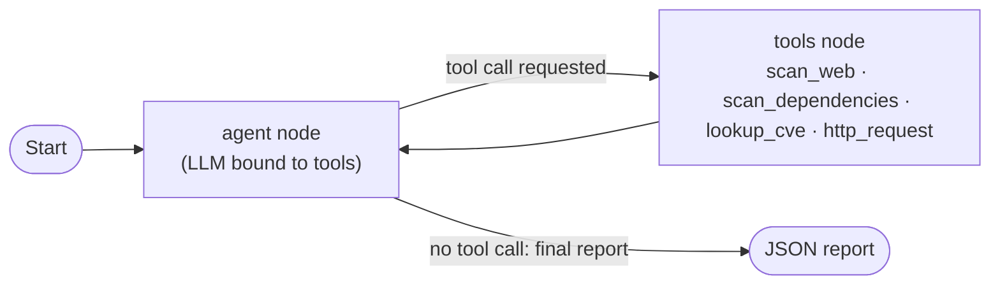

# Zalzala AI

**An agentic vulnerability-assessment pipeline.** An LLM agent, built on
LangGraph, autonomously assesses locally hosted, intentionally vulnerable
web targets, correlates what it finds to real published CVEs where one
applies, and produces a structured report per target — with no fixed,
hand-scripted sequence of steps.


## Overview

Zalzala AI is config-driven across multiple approved local targets — it
currently runs against [OWASP Juice Shop](https://owasp.org/www-project-juice-shop/)
and [DVWA](https://github.com/digininja/DVWA), and adding another approved
target is a `config.json` change, not a code change. For each target, the
agent runs a security assessment end to end without manual, step-by-step
operator intervention:

1. **Discovers** web-layer misconfigurations (missing security headers,
   exposed paths, server version disclosure) with a native header and path
   check, and dependency vulnerabilities with `npm audit` against the exact
   packages installed, where the target's stack supports it.
2. **Tests actively**, adapting to whatever platform it's pointed at:
   registers or logs in however the target's auth works, then probes for
   SQL injection, cross-site scripting, and broken access control, quoting
   the real HTTP response as evidence before ever calling a finding
   confirmed.
3. **Correlates** findings to a real CVE where one exists — resolving GitHub
   Security Advisory IDs to CVE identifiers via OSV.dev for dependency
   findings, then enriching high-severity CVEs with CVSS scores and
   Exploit-DB references from the NVD. Most active-testing findings (SQLi,
   XSS, IDOR discovered this way) are application-specific to the lab
   instance and correctly have no CVE — the report says so explicitly
   rather than leaving the field blank.
4. **Reports** a structured JSON of findings per target: id, status
   (confirmed / suspected / inconclusive / rejected), evidence, CVE, CVSS,
   Exploit-DB link, and remediation.

The agent — not a fixed script — decides which tool to call, in what order,
and when it has gathered enough evidence to stop. That decision loop is what
makes this agentic rather than a scripted pipeline with an LLM bolted on.

## How it works



This is a [LangGraph](https://github.com/langchain-ai/langgraph) `StateGraph`
with two nodes, compiled fresh per target so tool state (cookies, session
tokens) never leaks between targets. The `agent` node calls an LLM — either
OpenRouter (with automatic fallback across a list of models if one is
rate-limited or deprecated) or NVIDIA NIM, selected via `LLM_PROVIDER` in
`.env`. If the model's reply requests a tool call, control passes to the
`tools` node, which executes it and loops back. Once the model replies with
a JSON object instead of a tool call, that's the final report for that
target and the graph ends.

## Features

- **Agentic control flow** — the model chooses the next action per target;
  the graph doesn't hardcode a scan order or a fixed set of endpoints.
- **Generalized across platforms, not hardcoded to one** — the same system
  prompt and tool set adapt to a JSON/REST API (Juice Shop) or a
  traditional HTML-form, cookie-based application (DVWA) by reading each
  platform's own responses rather than assuming a fixed URL scheme.
- **Real CVE correlation, not guesswork** — `npm audit` only returns GHSA
  IDs, not CVE numbers, so this pipeline resolves them via OSV.dev rather
  than relying on the model already knowing a CVE number from training.
- **Model-fallback chain** — free-tier LLM availability shifts often; the
  agent rotates to the next configured model on a rate limit or a
  deprecated model ID instead of failing the run.
- **Scope enforcement by construction** — every tool acts only on the
  target passed to it from `config.json`'s allowlist; `http_request`
  rejects a full URL or a different host outright, so the agent cannot be
  steered outside the approved target even if it tried.
- **Evidence-based status, not blanket confirmation** — every finding is
  tagged confirmed, suspected, inconclusive, or rejected based on whether a
  tool response actually demonstrated it; a suspected issue that testing
  disproves is reported as rejected rather than dropped or overstated.
- **Config-driven, not hardcoded** — adding a new approved target is a
  `config.json` change (its URL, a platform hint, and a dependency-scan
  type), not a code change.

## Quickstart

Prerequisites: Python 3, Node.js and npm (for Juice Shop), an OpenRouter or
NVIDIA NIM API key, and — if you want DVWA included — a local PHP/MySQL
stack such as XAMPP with DVWA installed and reachable.

```powershell
cd agent
pip install -r requirements.txt
copy .env.example .env   # add your OPENROUTER_API_KEY or NVIDIA_API_KEY, and LLM_PROVIDER
```

To run the full multi-target assessment (starts Juice Shop and the LLM
gateway, checks DVWA is reachable, then runs the agent against every target
in `config.json` in one execution), run the orchestrator from the project
root:

```powershell
python run_assessment.py
```

To run the agent directly against whatever targets are already up, without
the orchestrator starting anything:

```powershell
cd agent
python main.py
```

Full configuration fields and output layout are documented in
[`agent/README.md`](agent/README.md).

## Project structure

```
.
├── agent/                        # the pipeline itself
│   ├── tools.py                  # scan_web, scan_dependencies, lookup_cve, http_request
│   ├── graph.py                  # the LangGraph StateGraph + system prompt
│   ├── main.py                   # per-run entry point (one or more configured targets)
│   ├── config.json               # targets, allowlist, model lists per provider
│   ├── output/                   # per-target transcript.json and report.json after a run
│   └── README.md                 # setup/run instructions
├── run_assessment.py             # orchestrator: brings services up, then runs agent/main.py
├── Plan/
│   └── Task1_Workflow_Design.md  # original workflow design write-up
└── CLAUDE.md                     # coding guidelines for this repo
```

## Scope and safety

This project only ever targets locally hosted, intentionally vulnerable
practice applications on the approved list (OWASP Juice Shop, DVWA). The
target allowlist is enforced in code, not just documented as policy — any
target not on the list is rejected before a tool runs, and `http_request`
refuses a full URL or a different host even if the model supplied one. This
is a coursework project; it is not intended or designed for use against
real or production systems.

## Known limitations

- **`scan_web` is a lightweight native check, not a full OWASP ZAP scan.**
  It covers response headers, cookie flags, server banners, and a small set
  of known paths — a useful, fast pre-scan, but a narrower surface than a
  real ZAP baseline or active scan would cover.
- **Exploit-DB matching can legitimately return nothing.** Many dependency
  CVEs (prototype pollution, algorithm confusion, ReDoS) are fixed by a
  version bump and never get a standalone proof-of-concept on Exploit-DB.
  An empty `exploit_db` field means none was found in the CVE's NVD
  references, not a broken lookup.
- **Most active-testing findings have no CVE, correctly.** SQL injection,
  XSS, and IDOR findings confirmed through `http_request` are typically
  application-specific to the lab instance rather than a versioned product
  defect, so `cve` is null with a `cve_match_note` explaining why — this is
  expected, not a gap in the correlation step.
- **Free-tier LLM availability drifts.** Model IDs get deprecated or
  rate-limited without notice; `config.json`'s model lists should be
  checked against the provider's own model listing if a run fails outright.
- **Run-to-run scope can vary.** Which checks the agent chooses to run
  within its call budget is not fully deterministic, so two runs against
  the same target can surface a different subset of findings.
- **OWASP Top 10 / CWE and course-concept mapping are intentionally out of
  scope for the agent** — that mapping is a manual, no-GenAI step performed
  separately, per the assignment's requirements.